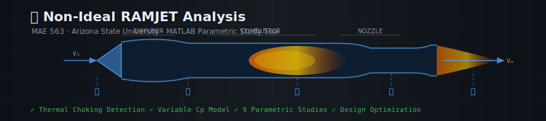
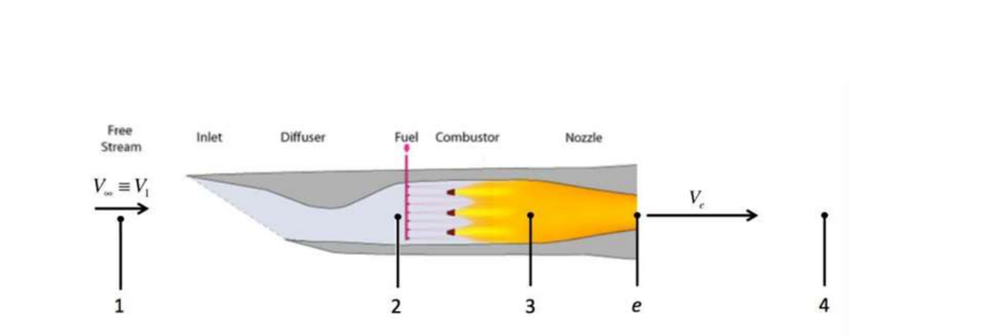
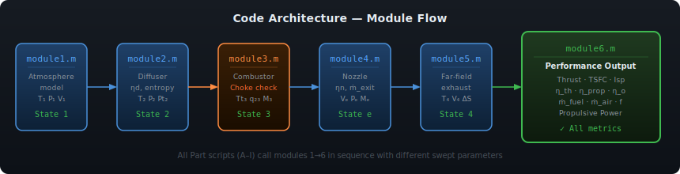

<div align="center">



 
**Author:** Vaishanavi Sogalad

</div>

---

## 📖 What Is This Project? (Start Here)

This project builds a **MATLAB simulation tool** that predicts how well a **RAMJET engine** performs under different flying conditions.

### What is a RAMJET?

A RAMJET is a type of air-breathing jet engine with **no moving parts** — no fans, no compressors. Instead, it uses the sheer speed of the aircraft to compress incoming air ("RAM compression"). This makes it incredibly simple but also means it **only works at supersonic speeds** (typically above Mach 1.5).

RAMJETs are used in missiles, high-speed drones, and experimental aircraft because they can reach very high speeds efficiently.

```
                  ┌──────────────────────────────────────────────┐
 Free             │                                              │
 Stream  ──1──▶  Diffuser  ──2──▶  Combustor  ──3──▶  Nozzle  ──▶  4
 (air)           │  (slows air,      (adds fuel,        (accelerates │
                 │   raises pressure)  burns it)          exhaust)    │
                 └──────────────────────────────────────────────┘
                    State 1    State 2    State 3    State e   State 4
```



### What Does This Tool Do?

Given flight conditions (altitude, Mach number, component efficiencies), the tool computes **everything** happening at each station of the engine:

- Temperatures, pressures, velocities at every station
- How much thrust the engine produces
- How efficient it is
- How much fuel it burns per unit of thrust (TSFC)

It then runs **parametric sweeps** — varying one input at a time — to answer questions like:
> *"At what Mach number does this engine produce the most thrust?"*  
> *"What happens to efficiency as altitude increases?"*  
> *"How important is diffuser quality compared to nozzle quality?"*

---

## 🔑 Key Concepts Explained Simply

### Thermodynamic States (1, 2, 3, e, 4)

Think of these as "checkpoints" along the flow path through the engine:

| State | Location | What's happening |
|---|---|---|
| **1** | Freestream / diffuser inlet | Air rushing in at flight speed |
| **2** | Diffuser exit / combustor inlet | Air slowed down, pressure raised |
| **3** | Combustor exit / nozzle inlet | Air heated by fuel combustion |
| **e** | Nozzle exit | Hot gas accelerated out the back |
| **4** | Far-field exhaust | Gas mixing with atmosphere |

### Thermal Choking — What Is It?

Imagine trying to push more and more water through a garden hose while simultaneously heating it. Eventually, the hose can't pass more flow — it's "choked." 

In a RAMJET combustor, the same thing happens with heat: if you add too much heat to a subsonic duct, the flow reaches **Mach 1 at the exit** — this is called **thermal choking**. Once choked, adding MORE fuel doesn't raise temperature further — it just stalls the engine.

- **Non-thermally choked (Case a, M2=0.15):** You can reach the full design temperature Tt3_max. More work output, better performance.
- **Thermally choked (Case b, M2=0.40):** The combustor chokes at a temperature BELOW Tt3_max. Performance is capped.

### Isentropic Efficiency

Nothing in real life is perfect. An "isentropic" process is a theoretical perfect process (no energy wasted). Real components are rated by how close they come to this ideal:

- **Diffuser efficiency (ηd = 0.92):** The real diffuser captures 92% of what a perfect diffuser would
- **Nozzle efficiency (ηn = 0.94):** The real nozzle extracts 94% of what a perfect nozzle would

### What is TSFC?

**Thrust-Specific Fuel Consumption** = kg of fuel burned per hour, per Newton of thrust produced.

Lower TSFC = more fuel-efficient. For missiles and drones, TSFC matters less than raw thrust — you want to go fast, not far.

### T-s Diagram (Temperature vs Entropy)

This is the "map" of the thermodynamic cycle. The **enclosed area = net work output**. Bigger enclosed area = more thrust potential.

- Heat addition (combustor) = moves right (entropy increases) and up (temperature rises)
- Compression/expansion = ideally vertical (no entropy change), but real components add entropy
- The goal: maximize the enclosed area while staying within material temperature limits (Tt3 ≤ 2400 K)

---

## 📁 Repository Structure



```
MAE563-Ramjet-Propulsion-Analysis/
│
├── 📌 CORE ENGINE MODULES (run by everything else)
│   ├── module1.m    ← Atmosphere model + freestream conditions (State 1)
│   ├── module2.m    ← Diffuser: slows flow, raises pressure (State 2)
│   ├── module3.m    ← Combustor: adds heat, checks thermal choking (State 3)
│   ├── module4.m    ← Nozzle: accelerates exhaust, checks nozzle choking (State e)
│   ├── module5.m    ← Far-field exhaust state (State 4)
│   └── module6.m    ← Performance metrics: Thrust, TSFC, Isp, efficiencies
│
├── 🚀 MAIN VALIDATION SCRIPTS
│   ├── main_nonchoked.m   ← Run Case a (M2=0.15, not thermally choked)
│   └── main_choked.m      ← Run Case b (M2=0.40, thermally choked)
│
├── 📊 PARAMETRIC STUDY SCRIPTS
│   ├── PartA_TsDiagrams.m          ← T-s diagrams for both validation cases
│   ├── PartB_Atmosphere.m          ← Isentropic vs. ICAO Standard Atmosphere
│   ├── PartC_MachVariation.m       ← Sweep M1 from 0.8 to 5
│   ├── PartD_AltitudeVariation.m   ← Sweep altitude from 2,000 to 30,000 m
│   ├── PartE_Optimization.m        ← Find optimal M1 for each altitude
│   ├── PartF_DiffuserEfficiency.m  ← Sweep diffuser efficiency 0.5 → 1.0
│   ├── PartG_NozzleEfficiency.m    ← Sweep nozzle efficiency 0.5 → 1.0
│   ├── PartH_M2Variation.m         ← Sweep combustor inlet Mach 0.1 → 2.5
│   └── PartI_DesignOptimization.m  ← Optimal design at M1=5, z=27,400 m
│
└── README.md   ← You are here
```

> **How the pieces fit together:**  
> The `module*.m` files are like sub-routines — they do one job each.  
> The `main_*.m` and `Part*.m` scripts call the modules in sequence to build up the full picture of the engine.

---

## ⚙️ How to Run This

### Step 1 — Install MATLAB
You need MATLAB installed (R2021a or newer). No additional toolboxes required.

### Step 2 — Download this repository
Click the green **Code** button on GitHub → **Download ZIP** → extract to a folder.

Or if you have Git installed:
```bash
git clone https://github.com/vaishnavi-soga/MAE563-Ramjet-Propulsion-Analysis.git
```

### Step 3 — Open MATLAB and navigate to the folder
In MATLAB, go to **Home → Open** and navigate to the folder you extracted.  
Or type in the MATLAB command window:
```matlab
cd 'C:\path\to\MAE563-Ramjet-Propulsion-Analysis'
```

### Step 4 — Run the validation cases
```matlab
main_nonchoked    % Type this and press Enter
```
When prompted: enter `4300` (the validation altitude in meters).

```matlab
main_choked       % Then run this
```

### Step 5 — Run parametric study plots
```matlab
PartA_TsDiagrams       % T-s diagrams
PartC_MachVariation    % Effect of Mach number
PartF_DiffuserEfficiency  % Diffuser sensitivity
% ... and so on
```

---

## 📥 Inputs Reference

All scripts use these baseline parameters (matching the validation cases from the report):

| Parameter | Symbol | Value | Units | Description |
|---|---|---|---|---|
| Gas constant | R | 286.9 | J/(kg·K) | For air |
| Flight altitude | z | 4300 | m | (varied in parametric studies) |
| Flight Mach number | M1 | 2.4 | — | Freestream speed |
| Diffuser exit Mach | M2 | 0.15 / 0.40 | — | 0.15 = unchoked, 0.40 = choked |
| Max combustor temp | Tt3_max | 2400 | K | Material temperature limit |
| Fuel heating value | qf | 43.2×10⁶ | J/kg | Kerosene-type jet fuel |
| Diffuser efficiency | ηd | 0.92 | — | 92% of ideal |
| Nozzle efficiency | ηn | 0.94 | — | 94% of ideal |
| Nozzle exit area | Ae | 0.015 | m² | |

---

## 📤 Outputs Reference

For each station (States 1, 2, 3, e, 4):

| Output | Symbol | Units |
|---|---|---|
| Static temperature | T | K |
| Total (stagnation) temperature | Tt | K |
| Static pressure | P | kPa |
| Total (stagnation) pressure | Pt | kPa |
| Entropy rise from State 1 | s − s₁ | J/(kg·K) |
| Flow velocity | V | m/s |
| Mach number | M | — |

Global engine performance:

| Output | Symbol | Units | Meaning |
|---|---|---|---|
| Total thrust | T | N | Force pushing the aircraft forward |
| Jet thrust component | Tj | N | From exhaust momentum |
| Pressure thrust component | Tp | N | From nozzle pressure difference |
| Fuel mass flow rate | ṁf | kg/s | How fast fuel is consumed |
| Air mass flow rate | ṁin | kg/s | Air captured by the engine |
| Fuel-to-air ratio | f | — | ṁf / ṁin |
| TSFC | — | kg/(hr·N) | Fuel per unit thrust |
| Specific impulse | Isp | s | Higher = more thrust per unit fuel weight |
| Thermal efficiency | ηth | — | Fuel energy → kinetic energy |
| Propulsive efficiency | ηprop | — | Kinetic energy → thrust work |
| Overall efficiency | η₀ | — | ηth × ηprop |

---

## 📊 Parametric Studies Summary

### Part A — T-s Diagrams
Visualizes the Brayton thermodynamic cycle. The thermally choked case (M2=0.40) has a smaller enclosed area than the unchoked case (M2=0.15), meaning less net work and lower performance.

### Part B — Atmosphere Model Validation
Compares the isentropic atmosphere model used in this project against the ICAO Standard Atmosphere. Pressures match very closely. Temperature diverges above ~8 km (stratosphere) but remains acceptable for the altitude ranges of interest.

### Part C — Effect of Flight Mach Number (M1: 0.8 → 5)
| Metric | Peak value | At M1 |
|---|---|---|
| Overall efficiency η₀ | 0.264 | 2.8 |
| Total thrust | ~3.6 kN | 4.0–4.5 |
| TSFC | increases sharply | above 3.5 |

**Why does efficiency peak at M1=2.8?** Below this speed, ram compression is insufficient. Above it, the increasing freestream kinetic energy (which must be decelerated by the diffuser) creates diminishing returns.

### Part D — Effect of Altitude (z: 2,000 → 30,000 m)
- Efficiency decreases linearly up to ~8,000 m, then plateaus (atmosphere becomes isothermal)
- Thrust decreases significantly (thinner air = less mass flow = less thrust)
- TSFC follows same trend as efficiency

### Part E — Optimal Mach Number per Altitude
For each altitude, finds the M1 that maximizes η₀ and the M1 that minimizes TSFC. Both optimal Mach numbers plateau above ~4,000 m altitude.

### Part F — Diffuser Efficiency (ηd: 0.5 → 1.0)
The diffuser is the most critical component. Going from 50% to 100% diffuser efficiency:
- Thrust increases **4×** (2,000 N → 8,000 N)
- η₀ increases from ~0.56 to ~0.57 (peaks at isentropic ηd=1.0)
- TSFC drops from ~5.8×10⁻⁵ to ~4.8×10⁻⁵ kg/(hr·N)

### Part G — Nozzle Efficiency (ηn: 0.5 → 1.0)
Same sweep for the nozzle. Going from 50% to 100% nozzle efficiency:
- Thrust increases **~2.3×** (less impact than diffuser)
- **Conclusion:** Prioritize diffuser quality over nozzle quality when designing for thrust.

### Part H — Combustor Inlet Mach Number (M2: 0.1 → 2.5)
- Performance is acceptable only for M2 < 0.3
- Above M2 ≈ 0.3, combustor chokes → thrust drops sharply
- Above M2 ≈ 0.6, overall efficiency goes **negative** (engine produces drag instead of thrust)

### Part I — Optimal Design at M1=5, z=27,400 m
Both M2 and Tt3 are varied simultaneously to find the optimum:

| Objective | Optimal M2 | Optimal Tt3 | Result |
|---|---|---|---|
| Max Thrust | 0.41 | 2460 K | 1972.5 N |
| Max Efficiency | 0.40 | 2439 K | η₀ = 0.1401 |

---

## 🧮 Key Equations

### Isentropic Atmosphere Model

For **z < 7,958 m** (troposphere):

$$\frac{T(z)}{T_s} = 1 - \frac{\gamma-1}{\gamma}\frac{z}{z^*}, \qquad \frac{P(z)}{P_s} = \left(1 - \frac{\gamma-1}{\gamma}\frac{z}{z^*}\right)^{\frac{\gamma}{\gamma-1}}$$

For **z ≥ 7,958 m** (stratosphere): T = 210 K,   P = 33.6 · exp(−(z−7958)/6605) kPa

Where: Ts = 288 K, Ps = 101.3 kPa, γ = 1.4, z* = 8404 m

### Thermal Choking Temperature (Rayleigh Flow)

$$T_{t3,\text{choked}} = T_{t2} \cdot \frac{1}{2(\gamma+1)} \cdot \frac{(1 + \gamma M_2^2)^2}{M_2^2 \left(1 + \frac{\gamma-1}{2}M_2^2\right)}$$

### Variable Specific Heat (Caloric Imperfect Gas)

$$C_p(T) = 986 + 0.179 \cdot T \quad \text{[J/(kg·K)]}$$

$$q_{23} = 986(T_{t3} - T_{t2}) + \frac{0.179}{2}(T_{t3}^2 - T_{t2}^2) \quad \text{[J/kg]}$$

### Thrust

$$T = \underbrace{\dot{m}_{in}\left[(1+f)V_e - V_1\right]}_{T_j \text{ (jet thrust)}} + \underbrace{(P_e - P_1)A_e}_{T_p \text{ (pressure thrust)}}$$

### Efficiencies

$$\eta_{th} = \frac{\dot{m}_e \frac{V_{eq}^2}{2} - \dot{m}_{in}\frac{V_1^2}{2}}{\dot{m}_{in} \cdot q_{23}}, \qquad \eta_{prop} = \frac{2}{1 + V_{eq}/V_1}, \qquad \eta_0 = \eta_{th} \cdot \eta_{prop}$$

---

## 💡 Conclusions

1. **RAMJET engines are fundamentally speed-dependent.** They need M1 > 1.5 to work properly — below this, ram compression is insufficient.

2. **The diffuser is the most critical component.** A poor diffuser wastes the ram compression that is the RAMJET's entire operating principle.

3. **Thermal choking is a hard performance ceiling.** Keeping M2 low (< 0.3) is essential to avoid it.

4. **Material limits (Tt3 ≤ 2400 K) constrain maximum performance.** Future advances in high-temperature materials could significantly improve RAMJET capability.

5. **There is an optimal Mach number (~2.8) for efficiency**, but an optimal Mach number of ~4–4.5 for maximum thrust. Mission requirements dictate which matters more.

---


---

## 📄 License

Developed for academic purposes. Free to reference or adapt with attribution.
